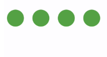

MotionMachine is a powerful yet elegant animation library for Swift. It offers sensible default functionality that abstracts most of the hard work away, allowing you to focus on your work. But MotionMachine also makes it easy to dive in and modify for your own needs, whether that be custom motion classes, supporting custom value types, or new easing equations.

## Overview

MotionMachine provides a modular, generic platform for manipulating values. Its animation engine was built from the ground up to support not just UIKit values, but property values of any class you want to manipulate. MotionMachine does support most major UIKit types out of the box and provides syntactic sugar to easily manipulate them.

* Animation engine built from the ground up (not tied to Core Animation).
* Motions can be grouped, sequenced, and nested in any arrangement and have reversing and repeating actions applied at any level.
* Animate properties of UIKit or any generic classes.
* Includes both static and physics-based motion classes, and both support additive animation.
* Powerfully modular – most aspects can be customized or outright replaced to fit your specific needs.
* Provides status callback closures for many types of motion events.
* Fully tested
* Fully [documented](https://poetmountain.github.io/MotionMachine/)


## Getting Started

##### Get started with the **[Motion Classes guide](Guides/MoveableClasses.md)** for detailed explanations and examples.

Also check out the [Examples project](Examples) to see all the MotionMachine classes in action, or dive deep into the source [Documentation](https://poetmountain.github.io/MotionMachine/).


#### Example


This complex animation was created with the code sample below. These `Motion` classes animate the NSLayoutConstraints of the circle views (_the constraints object in the `target` parameter is a dictionary of NSLayoutConstraint references_) as well as one of their `backgroundColor` properties. A `MotionGroup` object is used to synchronize the four `Motion` objects and reverse their movements.
```swift
let group = MotionGroup()

.add(Motion(target: constraints["circleX"]!,
        properties: [PropertyData("constant", 200.0)],
          duration: 1.0,
            easing: EasingQuartic.easeInOut()))

.add(Motion(target: constraints["circleY"]!,
        properties: [PropertyData("constant", 250.0)],
          duration: 1.4,
            easing: EasingElastic.easeInOut()))

.add(Motion(target: circle,
        properties: [PropertyData("backgroundColor.blue", 0.9)],
          duration: 1.2,
            easing: EasingQuartic.easeInOut()))

.add(Motion(target: constraints["circle2X"]!,
        properties: [PropertyData("constant", 300.0)],
          duration: 1.2,
            easing: EasingQuadratic.easeInOut())
            .reverses(withEasing: EasingQuartic.easeInOut()))

.start()
```

<br />
#### How does this work?

All of the included motion classes in MotionMachine adopt the `Moveable` protocol, which enables them to work seamlessly together. By using the `MotionGroup` and `MotionSequence` collection classes to control multiple motion objects – even nesting multiple layers – you can create complex animations with little effort. If you want to use your own custom motion classes within the MotionMachine ecosystem, simply have them adopt the `Moveable` protocol. However, the base `Motion` class offers such modularity that in most cases you can just add to or replace the components you need with your own implementation.

<br />
#### Motion

`Motion` uses a KVC keyPath (i.e. "frame.origin.x") to target specific properties of an object and transform their values over a period of time via an easing equation. In this example, we pass in `PropertyStates` structs to the statesForProperties convenience initializer to provide ending value states for the transform and backgroundColor properties of the target object.

```swift

let new_color = UIColor.init(red: 91.0/255.0, green:189.0/255.0, blue:231.0/255.0, alpha:1.0)
let circle = circles[0]

motion = Motion(target: circle,
   statesForProperties: [
    PropertyStates(path: "transform", end: circle.transform.scaledBy(x: 1.5, y: 1.5)),
    PropertyStates(path: "backgroundColor", end: new_color)
    ],
              duration: 2.0,
                easing: EasingBack.easeInOut(overshoot: 0.5))
.reverses()
.start()
```


<br />
#### MotionGroup

`MotionGroup` is a `MoveableCollection` class that manages a group of `Moveable` objects, controlling their movements in parallel. It's handy for controlling and synchronizing multiple `Moveable` objects. `MotionGroup` can even control other `MoveableCollection` objects. In the below example, we told the MotionGroup to reverse and synchronize its child motions while doing so. What this means is that it will pause all motions after the forward movement is done, and only then will it reverse them. In this case, the horizontal movements pause while waiting for the Motion which modifies the second circle's backgroundColor to finish its 3 second duration.

```swift

// the MotionGroup will wait for all child motions to finish moving forward before starting their reverse motions
group = MotionGroup().reverses(syncsChildMotions: true)

// move first circle horizontally
let horizontal1 = Motion(target: constraints["x1"]!,
                         properties: [PropertyData("constant", 250.0)],
                         duration: 1.5,
                         easing: EasingSine.easeOut())
.reverses()
group.add(horizontal1)

// reverse and repeat horizontal movement of second circle once, with a subtle overshoot easing
let horizontal2 = Motion(target: constraints["x2"]!,
                  properties: [PropertyData("constant", 250.0)],
                  duration: 1.0,
                  easing: EasingBack.easeOut(overshoot: 0.12))
.reverses()
group.add(horizontal2)

// change backgroundColor of second circle
let color = Motion(target: circles[1],
                   statesForProperties: [PropertyStates(path: "backgroundColor", end: UIColor.init(red: 91.0/255.0, green:189.0/255.0, blue:231.0/255.0, alpha:1.0))],
                   duration: 3.0,
                   easing: EasingQuadratic.easeInOut())
group.add(color)

.start()
```


<br />
#### MotionSequence

`MotionSequence` is a `MoveableCollection` class which moves a collection of `Moveable` objects in sequential order, even other `MoveableCollection` objects. `MotionSequence` provides a powerful and easy way of chaining together value transformations of object properties to do keyframing or to create complex and fluid compound animations of many objects.

```swift

// create a reversing MotionSequence with its reversingMode set to contiguous to create a fluid animation from its child motions
sequence = MotionSequence().reverses(.contiguous)

// set up motions for each circle and add them to the MotionSequence
for x in 0..<4 {
    // motion to animate a topAnchor constraint down
    let down = Motion(target: constraints["y\(x)"]!,
                      properties: [PropertyData("constant", 60.0)],
                      duration: 0.4,
                      easing: EasingQuartic.easeInOut())

    // motion to change background color of circle
    let color = Motion(target: circles[x],
                       statesForProperties: [PropertyStates(path: "backgroundColor", end: UIColor.init(red: 91.0/255.0, green:189.0/255.0, blue:231.0/255.0, alpha:1.0))],
                       duration: 0.3,
                       easing: EasingQuadratic.easeInOut())

    // wrap the Motions in a MotionGroup and set it to reverse
    let group = MotionGroup(motions: [down, color]).reverses(syncsChildMotions: true)

    // add group to the MotionSequence
    sequence.add(group)
}
sequence.start()
```




## Installation

If you use CocoaPods, add this pod to your Podfile:

##### Podfile
```ruby
    pod 'MotionMachine', '~> 1.3.0'
```

Or add the Sources directory to your project.

## Compatibility

MotionMachine currently requires:
* Swift 4.0
* Xcode 9.0 or later
* iOS 8.0 or later, tvOS 9.0 or later

#### Caveats

* MotionMachine uses Key-Value Coding (KVC) to introspect objects and retrieve and set their property values using keypaths. Because Swift currently offers no native ability in this regard, objects whose properties should be modified by MotionMachine must inherit from `NSObject`. If and when more dynamism is added to Swift (and the author of this library hopes that is the case), MotionMachine will hopefully be able to do away with this restriction. Note that as of Swift 4.0, any properties of a custom class you wish to manipulate must be prefixed with `@objc`, or add `@objcMembers` above the class if all properties should be exposed.

* Because native Swift structs cannot inherit from `NSObject`, Swift structs unfortunately cannot be used directly with MotionMachine at this time.

* The KVC provided by `NSObject` is not able to evaluate Optional values. Properties you wish to modify with MotionMachine must not be Optionals.

* Swift on Linux is not currently supported due to the lack of Foundation and Core Graphics frameworks on that platform.

## Credits

MotionMachine was created by [Brett Walker](https://twitter.com/petsound). It is based on the author's Objective-C library [PMTween](https://github.com/poetmountain/PMTween).


## License

MotionMachine is licensed under the MIT License. See LICENSE for details.

I'd love to know if you use MotionMachine in your projects!
